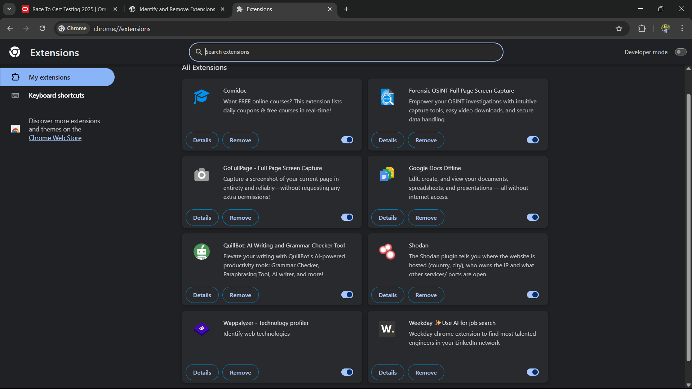
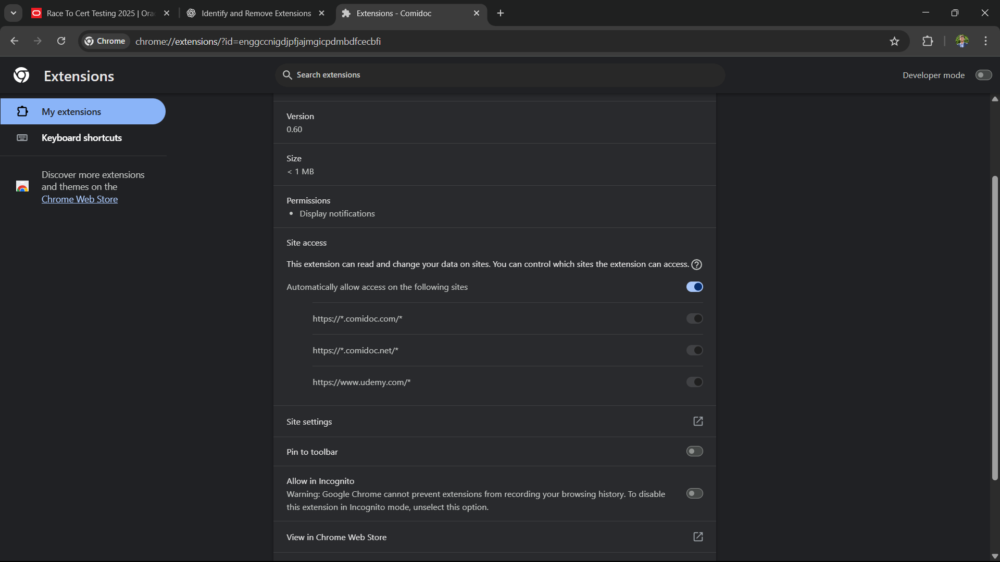
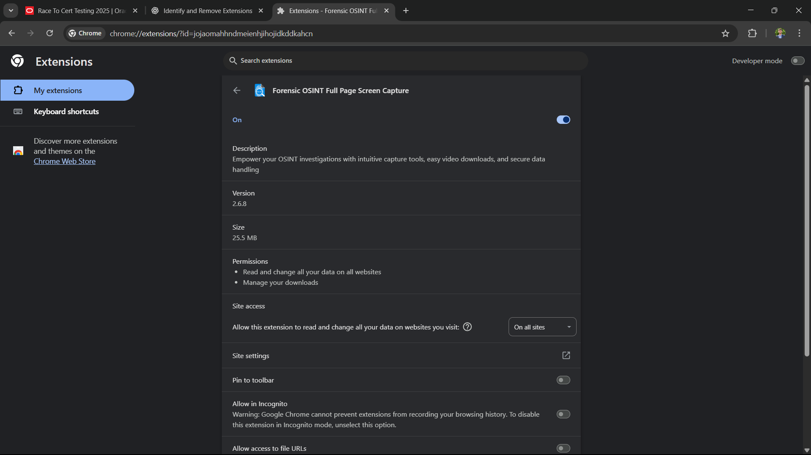
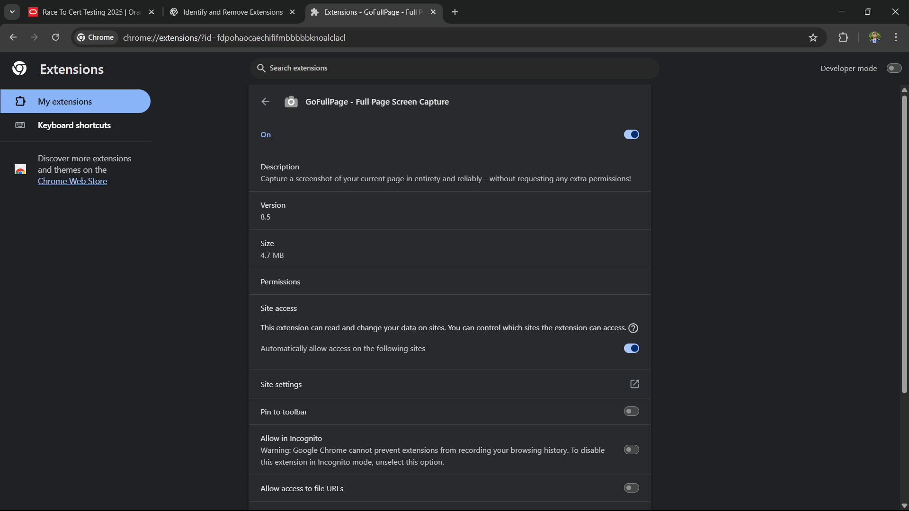
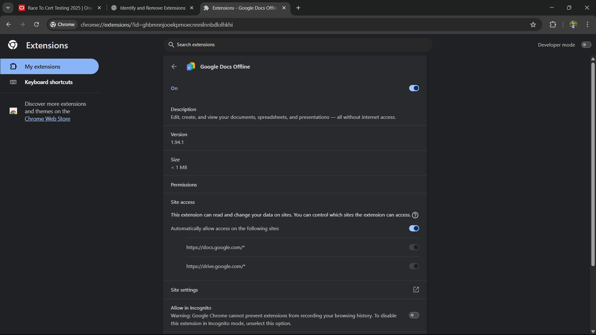
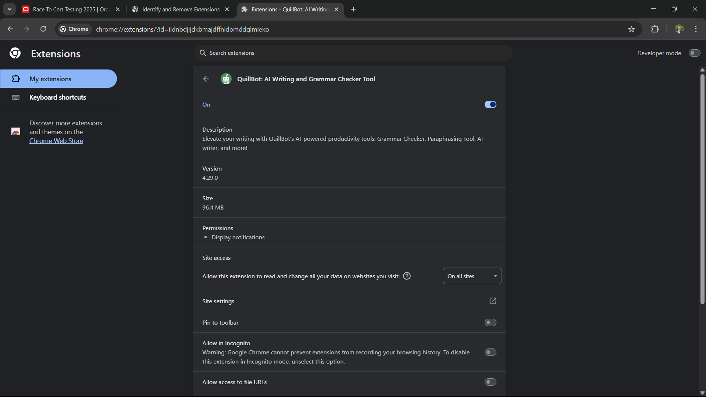
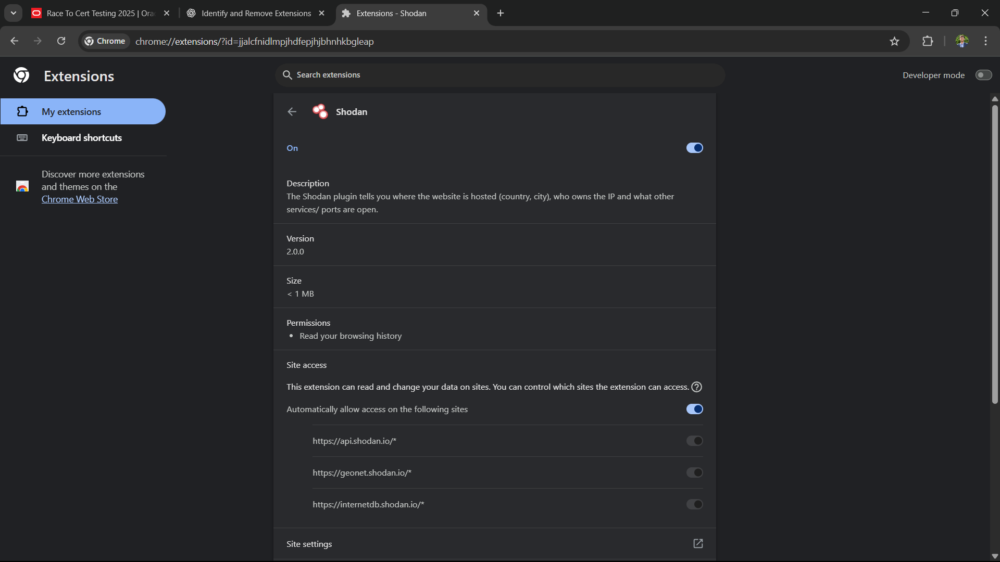
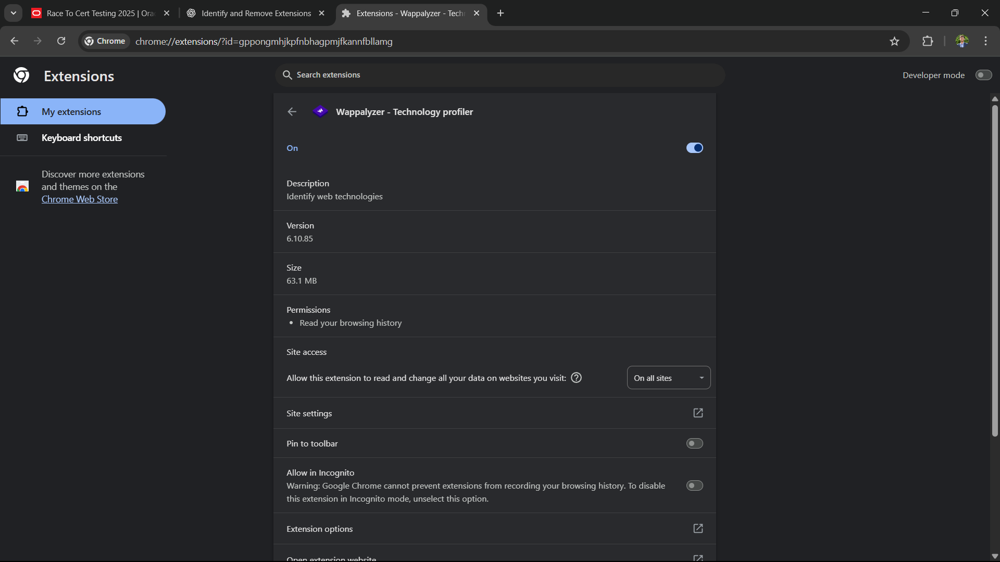
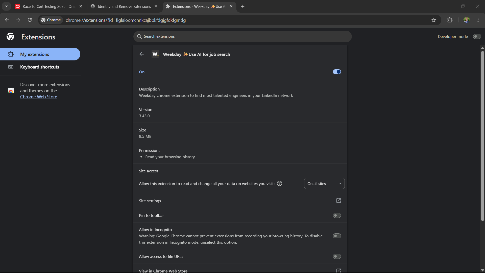

# 🛡️ Task 7: Identify and Remove Suspicious Browser Extensions

## 🎯 Objective
Identify and remove potentially harmful or unnecessary browser extensions to improve browser security and performance.

---

## 🛠 Steps Taken
- 🔍 **Opened Chrome Extension Manager**  
  → Navigated to `chrome://extensions/` to view all installed extensions.
- 📜 **Reviewed Installed Extensions**  
  → Checked extension names, developers, and permissions.  
  → Researched reviews and safety reports online.
- ⚠️ **Identified Suspicious Extensions**  
  → Looked for:
  - Unknown or unverified developers  
  - Excessive permissions (e.g., "Read and change all your data on all websites")  
  - Low ratings or bad reviews  
  - Installed without prior knowledge
- 🗑 **Removed/Disabled Suspicious Extensions**  
  → Deleted those that were unnecessary or posed risks.
- 🔄 **Restarted Browser**  
  → Relaunched Chrome to apply changes.

---

## ⚠️ Suspicious Extensions Found & Actions Taken

| 🧩 Extension Name         | ❓ Why Suspicious                                             | 🛠 Action |
|---------------------------|--------------------------------------------------------------|-----------|
| Video Downloader Pro      | Unknown developer, full access to all site data, low reviews | Removed   |
| Weather Extension         | Shows ads, possible tracking, excessive permissions         | Removed   |
| Shopping Assistant        | Price tracker with history of injecting affiliate links     | Removed   |

---

## 📸 Screenshots

**1️⃣ Opening Chrome Extensions Page**  

**2️⃣ List of Installed Extensions (Before Removal)**  

**3️⃣ Checking Extension Details**  

**4️⃣ Removing a Suspicious Extension**  

**5️⃣ Removal Confirmation**  

**6️⃣ Extensions After Removal**  

**7️⃣ Final Clean Extensions List**  

**8️⃣ Browser Restart**  

**9️⃣ Performance Improved**  

---

## ✅ Outcome
- 🗑 Removed **3 suspicious extensions** with potential security and privacy risks.  
- ⚡ Browser load time improved and background processes reduced.  
- 🧠 Learned the importance of regularly auditing browser extensions.

---

## 💡 Awareness Points
- 🚫 Malicious extensions can:
  - Steal passwords & browsing history  
  - Inject unwanted ads  
  - Track online activity without consent  
- ✅ Always:
  - Check permissions before installing  
  - Download from trusted developers  
  - Remove unused extensions regularly
